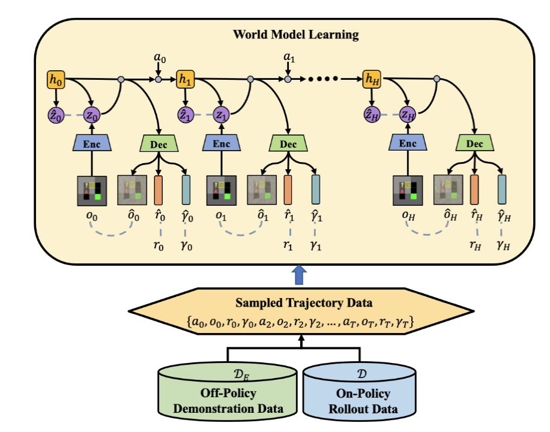
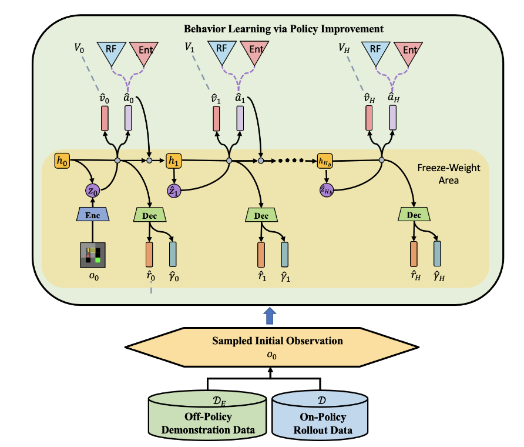
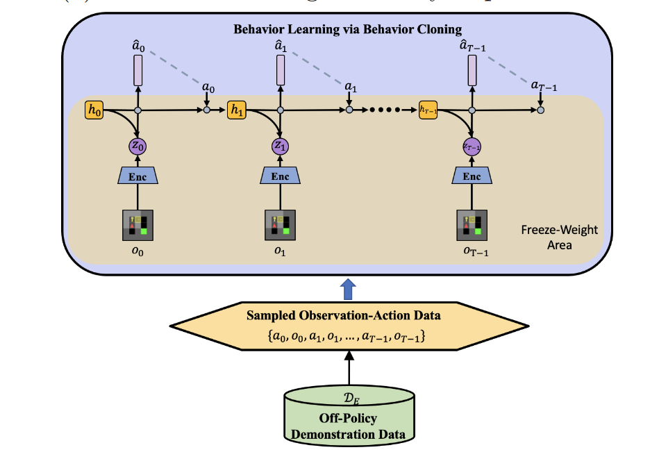

# Dreamer from Demonstrations (DreamerfD): Integrating DreamerV2 with Demonstrations

## Overview

We integrate [Dreamerv2](https://github.com/danijar/dreamerv2.git) with demonstrations to maximally improve learning efficiency.
## Method 

Compared with Dreamerv2, we have the following improvements/novelties:

- Demonstration-guided wolrd model learning and policy learning:
    Off-policy demonstration data is sampled by an additional Replay Buffer for world model learning and behavior learning.
<p style="text-align:center;">
    
    
</p>

- Behaviour cloning loss to regress actions of demonstration trajectories.
  <p style="text-align:center;">
    
</p>

For more information:
- [Project Website](https://sites.google.com/view/dreamerfd/home)


## Install

- Install [Anaconda](https://www.anaconda.com/download)

- Install Dependencies with GPU support
    ```sh
    conda create -n efficient_dreamer python=3.7
    conda activate efficient_dreamer
    conda install cudatoolkit=11.3 -c pytorch
    pip install tensorflow==2.9.0 tensorflow_probability==0.17.0
    conda install cudnn=8.2 -c anaconda
    pip install protobuf==3.20.1
    ```
- Install DreamerfD
    ```sh
    pip install -e .
    ```
